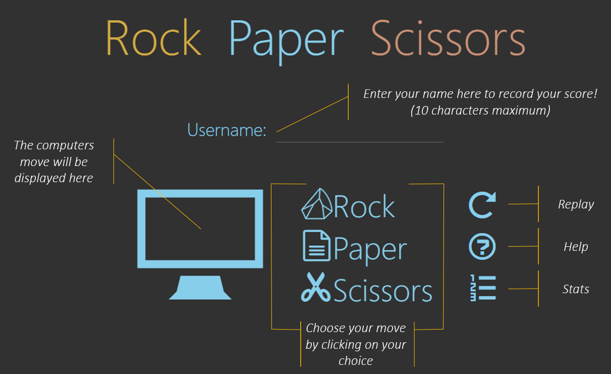
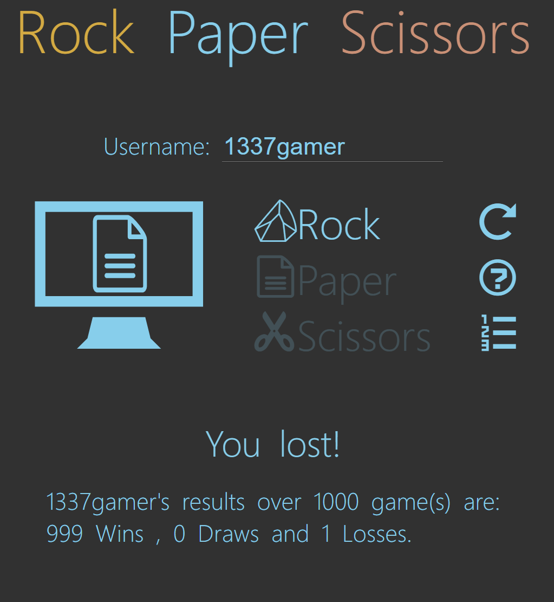
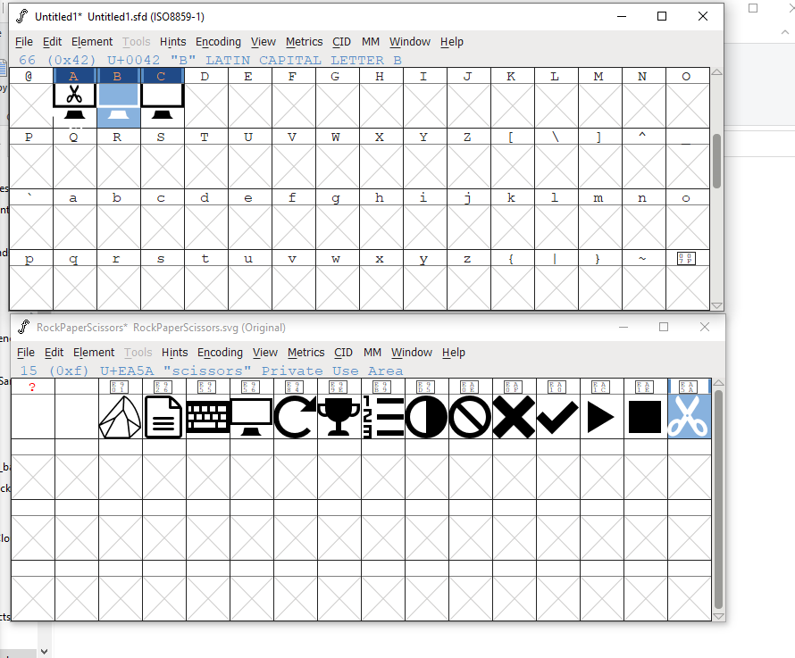
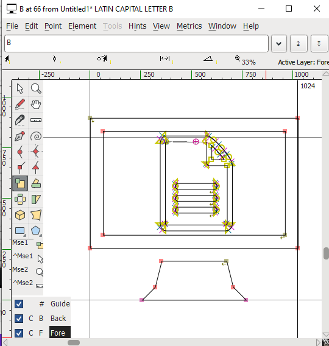

# Rock, Paper, Scissors!

## Task:
- Create a Rock Paper Scissors game using JS, CSS and HTML
- Ideally it would have a username function to save and load scores
- It must display the score on the page

## Design:
I thought I would go with a clean and relatively minimal design, using the bare minimum text in the initial interface. I wanted the design to be self-explanatory as much as possible. Just in case, I did include a help button which would explain the interface to avoid any confusion. The help interface will disappear on clicking again.  
  
I tried to make it look similar to a mobile app, centered in the screen, with icons to tap/click to perform various functions. Initially I had a play button so once the move was chosen, there was an oppurunity to re-select before playing, but it was too clunky on repeated testing, having to click play after selecting a move, therefore I changed it to play the game after clicking the move directly.  
I disallowed submit on the username, as I wanted the username to remain visible whislt being used, and to remove an extra button that is not required.    
The color scheme was taken from the default dark theme of VScode.  
I chose to use icons as I wanted to the change the color of the images/icons/moves on hovering. I could have also used transparent pngs here, but I chose to use SVGs/font-icons so I could scale them as I wanted.  

## Current Game:  

## Learning:  
I learned a lot mostly about JS and Icons from working on this game.
### JS:
I learned more about DOM event handlers. I had previously used HTML inline events, but I have since [learned](https://stackoverflow.com/a/6348597/15347906) that these are less flexible, and more prone to XSS. Therefore I refactored the code to use event handlers instead of relying on HTML events. 
I also initially coded the player as an object, but then learned about classes and constructors, so refactored the player into a class, and the game into a container, every new player would be added to a list of player objects, for recall or score checking. Old players would have their scores retrieved.
### Icons:  
I utilised the free software FontForge to edit these icons, and the online app [icomoon](https://icomoon.io/app/#/select) to generate a font from my chosen icons. I had to edit the icons to make them fit my purpose of displaying the computers move in the screen. 

## Some of the many potential areas for improvement:  
- Sanitise input to the username form and code a way to handle duplicate usernames e.g. with a userprompt
- Maybe make the computer a class
- Fix the alignment of the leaderboard CSS so it is left aligned but centered in the page
- Change the color of the icons dpeeneding on the win state i.e. green for either computer or the player winning, red for losing
- Utilise local storage or session storage to keep the scoreboard persistent after refreshing, would also then need to include a reset stats button
- Animations e.g. fireworks for winning or transitions, or animated fights between the moves e.g. scissors cutting paper using SVG paths
- Place the player constructor class in a separate file e.g. player.js, to clean up the code slightly
